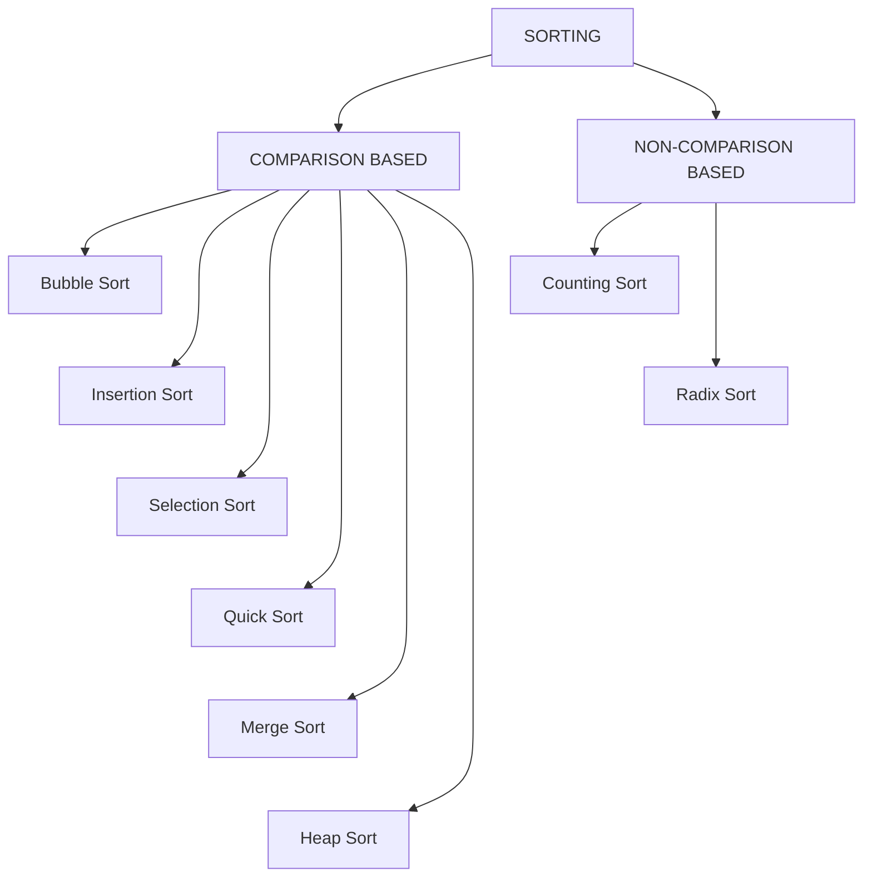

# Sorting Algorithm:

- Sorting algorithms are essential in Computer Science as they simplify complex problems and improve efficiency.
- They are widely used in searching, databases, divide and conquer strategies, and data structures.

## Types of Sorting Algorithms:



--- 

## Bubble Sort: 

- Bubble Sort is the simplest sorting algorithm that works by repeatedly swapping the adjacent elements if they are in the wrong order. 
- This algorithm is not efficient for large data sets as its average and worst-case time complexity are quite high.

**Example:**
```text
Suppose we need to sort an array = {5,3,8,4,2}

Rule: Compare two adjacent elements, if the 2nd element is smaller than the 1st, swap them.

Pass 1:

[ 5 | 3 | 8 | 4 | 2 ]
  ↓
Compare 5 and 3 → Swap

[ 3 | 5 | 8 | 4 | 2 ]
      ↑   ↑
    Compare 5 and 8 → No Swap

[ 3 | 5 | 8 | 4 | 2 ]
          ↑   ↑
    Compare 8 and 4 → Swap

[ 3 | 5 | 4 | 8 | 2 ]
              ↑   ↑
    Compare 8 and 2 → Swap

[ 3 | 5 | 4 | 2 | 8 ]
                    ✓
              Largest element
              placed at end

Pass 2:

[ 3 | 5 | 4 | 2 | 8 ]
  ↑   ↑
Compare 3 and 5 → No Swap

[ 3 | 5 | 4 | 2 | 8 ]
      ↑   ↑
Compare 5 and 4 → Swap

[ 3 | 4 | 5 | 2 | 8 ]
          ↑   ↑
Compare 5 and 2 → Swap

[ 3 | 4 | 2 | 5 | 8 ]
              ✓
        5 is now in position

Pass 3:

[ 3 | 4 | 2 | 5 | 8 ]
  ↑   ↑
Compare 3 and 4 → No Swap

[ 3 | 4 | 2 | 5 | 8 ]
      ↑   ↑
Compare 4 and 2 → Swap

[ 3 | 2 | 4 | 5 | 8 ]
          ✓
        4 is now in position

Pass 4:

[ 3 | 2 | 4 | 5 | 8 ]
  ↑   ↑
Compare 3 and 2 → Swap

[ 2 | 3 | 4 | 5 | 8 ]

        Sorted ✓

```
- > Note: No of Pass: `N-1` (`N` is size of array)
- > Note: After `k` passes, the largest `k` must have been moved to the last k positions.
- > Note: After `k` passes, the remaining `N-k` elements are compared and swaped if needed.

**Program:** JAVA

```java
public class Main{

    public static void bubbleSort(int arr[]){

        int n = arr.length;
        int temp;

        for (int i = 0; i<n-1; i++) {
            for (int j = 0; j<n-i-1; j++){
                if (arr[j+1]<arr[j]){
                temp = arr [j];
                arr [j] = arr [j+1];
                arr [j+1] = temp;
               }
            }
        }
    }

    public static void main(String[] args) {
        
        int arr[]= {2,6,8,7,1,4};

        bubbleSort(arr);

        for(int i = 0; i<arr.length; i++){
            System.out.print(arr[i]);
        }
    }
}
```

**Complexity:**
- Time: O(n2) [best case O(n2)]
- Space: O(1)

> Here both loops runs fully so best case time complexity also O(n2)

### Little Optimized:

```java
public static void bubbleSort(int arr[]){

        int n = arr.length;
        int temp;
        boolean swaped;

        for (int i = 0; i<n-1; i++) {

            swaped = false;

            for (int j = 0; j<n-i-1; j++){
                if (arr[j+1]<arr[j]){
                temp = arr [j];
                arr [j] = arr [j+1];
                arr [j+1] = temp;

                swaped = true;
               }
            }

            // If no swap happens in a complete pass, the array is already sorted, so it stops.

            if (swaped == false){
                break;
            }
        }
    }
```
**Complexity:**
- Time: O(n2)   [Best case O(n)]
- Space: O(1)

> Stops early when no swapping is needed, so if the array is already sorted, the best case can be `O(n)`.

---

## Insertion Sort:

- Insertion sort is a simple sorting algorithm that works by iteratively inserting each element of an unsorted list into its correct position in a sorted portion of the list. 

**Eaxmple:**
```text
Suppose we need to sort an array = {5,3,8,4,2}

Rule: Take the current element and compare it with the elements on its left.
      If the left element is greater, shift it to the right.
      Insert the current element at its correct position.

Pass 1:

[ 5 | 3 | 8 | 4 | 2 ]
  ✓   ↑
    Current element = 3

Compare 3 with 5 → Shift 5 to the right

[ 5 | 5 | 8 | 4 | 2 ]

Insert 3 at its correct position

[ 3 | 5 | 8 | 4 | 2 ]
  ✓   ✓
  Sorted portion


Pass 2:

[ 3 | 5 | 8 | 4 | 2 ]
          ↑
    Current element = 8

Compare 8 with 5 → No Shift

[ 3 | 5 | 8 | 4 | 2 ]
          ✓
    8 is already in position


Pass 3:

[ 3 | 5 | 8 | 4 | 2 ]
              ↑
    Current element = 4

Compare 4 with 8 → Shift 8

[ 3 | 5 | 8 | 8 | 2 ]

Compare 4 with 5 → Shift 5

[ 3 | 5 | 5 | 8 | 2 ]

Compare 4 with 3 → No Shift

Insert 4

[ 3 | 4 | 5 | 8 | 2 ]
          ✓
    Sorted portion


Pass 4:

[ 3 | 4 | 5 | 8 | 2 ]
                  ↑
    Current element = 2

Compare 2 with 8 → Shift 8

[ 3 | 4 | 5 | 8 | 8 ]

Compare 2 with 5 → Shift 5

[ 3 | 4 | 5 | 5 | 8 ]

Compare 2 with 4 → Shift 4

[ 3 | 4 | 4 | 5 | 8 ]

Compare 2 with 3 → Shift 3

[ 3 | 3 | 4 | 5 | 8 ]

Insert 2

[ 2 | 3 | 4 | 5 | 8 ]

        Sorted ✓
```

**Program:** JAVA

```java
public class Main{

    public static void insertionSort(int arr[], int n){

        for(int i=1; i<n; i++){

            int key = arr[i];
            int j = i-1;

            while (j>=0 && arr[j]>key){

                arr[j+1] = arr [j];

                j--;
            }

            arr [j+1] = key;

        }
    }

    public static void main(String[] args) {
        
        int arr[]= {2,6,8,7,1,4};
        int n = arr.length;

        insertionSort(arr,n);

        for(int i = 0; i<n; i++){
            System.out.print(arr[i]);
        }
    }
}
```
**Explaination:**
```text
lets take a example: arr ={4,3,1}

for i=1:

key = 3
j = 1-1 = 0

1st while iteration (0=0 && 4>3)

after performing  'arr[j+1] = arr [j];'  arr = {4,4,1}

then j--; // now j = -1 so while loop terminated

arr [j+1] = key; // arr[-1+1]= arr [0]= key = 3

so after i = 1 iteration: arr ={3,4,1}

for i=2:

key = 1
j= 1

1st while iteration (1>0 && 4>1)

after performing  'arr[j+1] = arr [j];'  arr = {3,4,4}
j--; // j=0

2nd while iteration (0=0 && 3>1)

after performing  'arr[j+1] = arr [j];'  arr = {3,3,4}

then j--; // now j = -1 so while loop terminated

arr [j+1] = key; // arr[-1+1]= arr [0]= key = 1

so after i = 2 iteration: arr ={1,3,4}

```
> After each iteration of i, the elements from index 0 to i are sorted.

**Complexity:**

- Time: O(n2) [Best Case: O(n)]
- Space: O(1)
> If the array is already sorted, arr[j] > key is false, so the while loop does not execute; only the outer loop runs n-1 times → O(n).

---

## Selection Sort: 

- Selection Sort is a comparison-based sorting algorithm. It sorts by repeatedly selecting the smallest (or largest) element from the unsorted portion and swapping it with the first unsorted element.

1. Find the smallest element and swap it with the first element. This way we get the smallest element at its correct position.
2. Then find the smallest among remaining elements (or second smallest) and swap it with the second element.
3. We keep doing this until we get all elements moved to correct position.

**Example:**
```text
Suppose we need to sort an array = {5,3,8,4,2}

Pass 1:

[ 5 | 3 | 8 | 4 | 2 ]
  ↑
  Unsorted portion

Find the smallest element → 2

Swap 2 with 5

[ 2 | 3 | 8 | 4 | 5 ]
  ✓
  Sorted portion


Pass 2:

[ 2 | 3 | 8 | 4 | 5 ]
      ↑
      Unsorted portion

Find the smallest element → 3

3 is already in its correct position

[ 2 | 3 | 8 | 4 | 5 ]
  ✓   ✓
  Sorted portion


Pass 3:

[ 2 | 3 | 8 | 4 | 5 ]
          ↑
          Unsorted portion

Find the smallest element → 4

Swap 4 with 8

[ 2 | 3 | 4 | 8 | 5 ]
  ✓   ✓   ✓
  Sorted portion


Pass 4:

[ 2 | 3 | 4 | 8 | 5 ]
              ↑
              Unsorted portion

Find the smallest element → 5

Swap 5 with 8

[ 2 | 3 | 4 | 5 | 8 ]
  ✓   ✓   ✓   ✓   ✓
      Sorted ✓
```

**Program:** JAVA

```java
public class Main{

    public static void selectionSort(int[] arr, int n) {

        for(int i = 0; i < n - 1; i ++){

            int temp = arr[i];
            int min = arr[i];
            int index = i;

            for(int j = i+1; j < n; j ++){

  
                
                if (min > arr [j]){

                    min = arr[j];
                    index = j;
                }
            }

            arr[i] = arr[index];
            arr[index] = temp;
        }  
    }
    public static void main(String[] args) {
        
        int arr[]= {2,6,8,7,1,4};
        int n = arr.length;

        selectionSort(arr,n);

        for(int i = 0; i < n; i ++){
            System.out.print(arr[i]);
        }
    }
}
```

**Complexity:**

- Time: O(n2)
- Space: O(1)

---

## Quick Sort:

- QuickSort is a sorting algorithm based on the Divide and Conquer that picks an element as a pivot and partitions the given array around the picked pivot by placing the pivot in its correct position in the sorted array. .

- There are mainly three steps in the algorithm:

1. Choose a Pivot: Select an element from the array as the pivot. The choice of pivot can vary (e.g., first element, last element, random element, or median).
2. Partition the Array: Re arrange the array around the pivot. After partitioning, all elements smaller than the pivot will be on its left, and all elements greater than the pivot will be on its right.
3. Recursively Call: Recursively apply the same process to the two partitioned sub-arrays.
4. Base Case: The recursion stops when there is only one element left in the sub-array, as a single element is already sorted.

**Example:**
```text
Suppose we need to sort an array = {5,3,8,4,2}

Rule: Choose the last element as the pivot.
      Place smaller elements on the left.
      Place larger elements on the right.

Pass 1:

[ 5 | 3 | 8 | 4 | 2 ]
                    ↑
              Pivot = 2

Compare elements with 2:

5 > 2 → Right
3 > 2 → Right
8 > 2 → Right
4 > 2 → Right

Place 2 at its correct position

[ 2 | 3 | 8 | 4 | 5 ]
  ✓
  Pivot in correct position


Now sort the right portion:

[ 3 | 8 | 4 | 5 ]

Choose last element as pivot

Pivot = 5

Compare:

3 < 5 → Left
8 > 5 → Right
4 < 5 → Left

Place 5 at its correct position

[ 3 | 4 | 5 | 8 ]
          ✓
          Pivot in correct position


Now sort the left portion:

[ 3 | 4 ]

Pivot = 4

3 < 4 → Left

[ 3 | 4 ]
      ✓


Final sorted array:

[ 2 | 3 | 4 | 5 | 8 ]
  ✓   ✓   ✓   ✓   ✓
      Sorted ✓
```

**Program:** JAVA

```java
public class Main{

    public static void quickSort(int[] arr, int n) {

        // 
    }
    public static void main(String[] args) {
        
        int arr[]= {2,6,8,7,1,4};
        int n = arr.length;

        quickSort(arr,n);

        for(int i = 0; i < n; i ++){
            System.out.print(arr[i]);
        }
    }
}
```

---

## Merge Sort: 


---

## Heap Sort:


---

## 