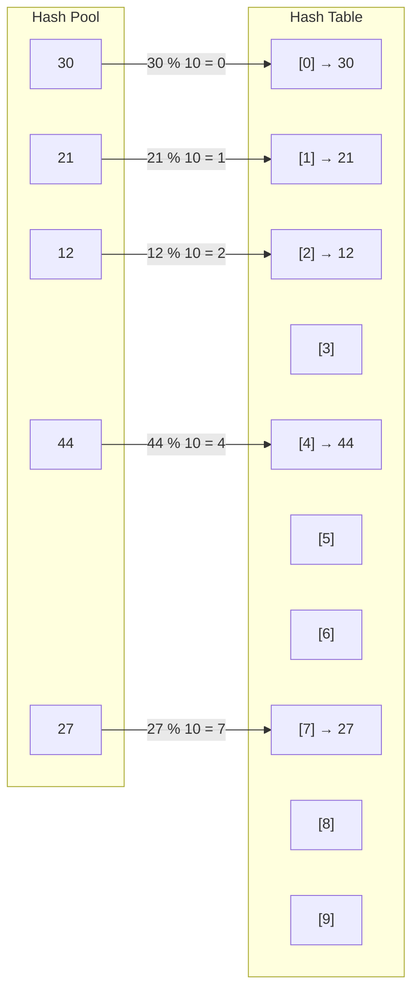

# Hashing:

- Hashing refers to the process of generating a small sized output (that can be used as index in a table) from an input of typically large and variable size. Hashing uses mathematical formulas known as hash functions to do the transformation. This technique determines an index or location for the storage of an item in a data structure called Hash Table.

- [Youtube](https://youtu.be/mFY0J5W8Udk?si=xvW3DzUxCHlsMzOk)

- Method to store or retrive data in O(1) time [average expected without collision]

## Components of Hashing:

- There are majorly three components of hashing:

1. **Key:** A Key can be anything string or integer which is fed as input in the hash function the technique that determines an index or location for storage of an item in a data structure.
2. **Hash Function:** Receives the input key and returns the index of an element in an array called a hash table. The index is known as the hash index .
3. **Hash Table:** Hash table is typically an array of lists. It stores values corresponding to the keys. Hash stores the data in an associative manner in an array where each data value has its own index.

### Hash Functions:

| Hash Function             | Formula / Method                                   | Example                                                           | Result / Use                                                |
| ------------------------- | -------------------------------------------------- | ----------------------------------------------------------------- | ----------------------------------------------------------- |
| **Division Method**       | `h(k) = k % m`                                     | `k = 25, m = 10` → `25 % 10`                                      | `5` — Most common basic method                              |
| **Multiplication Method** | `h(k) = floor(m × (kA mod 1))`                     | `k=25, m=10, A≈0.618` → `25×0.618=15.45` → fractional part `0.45` | `floor(10×0.45)=4`                                          |
| **Mid-Square Method**     | Square key → extract middle digits                 | `44² = 1936` → middle `93` → `93 % 10`                            | `3`                                                         |
| **Folding Method**        | Split key into parts → add parts                   | `12345678` → `12+34+56+78=180` → `180%10`                         | `0`                                                         |
| **Digit Extraction**      | Select specific digits from key                    | `123456` → select `2nd,4th,6th` → `246` → `246%10`                | `6`                                                         |
| **Digit Analysis**        | Choose digits that provide good distribution       | Keys: `123456, 124356, 125436` → choose varying digit positions   | Reduces collisions                                          |
| **String Character Sum**  | Sum character values                               | `"CAT"` → `67+65+84=216` → `216%10`                               | `6` — Simple but collision-prone                            |
| **Polynomial Hash**       | `h(s)=Σ s[i]×pⁱ mod m`                             | `"ABC"`, values `1,2,3`, `p=31`, `m=100` → `2946%100`             | `46`                                                        |
| **Rolling Hash**          | Update previous hash instead of recalculating      | `hash("ABC")` → remove `A`, add `D` to get hash of `"BCD"`        | Fast substring matching                                     |
| **Universal Hashing**     | `h(k)=((ak+b)%p)%m`                                | `k=25,a=3,b=7,p=101,m=10` → `82%10`                               | `2` — Reduces predictable collisions                        |
| **Perfect Hashing**       | Hash function maps each known key to a unique slot | Keys `{10, 20, 30}` → `10→0, 20→1, 30→2`                          | `O(1)` lookup, no collisions                                |
| **Cryptographic Hash**    | Complex one-way transformation                     | `"Hello"` → SHA-256 → fixed-length hash                           | Security, integrity; generally not used for DSA hash tables |
| **Java `hashCode()`**     | Built-in object/string hash function               | `"Hello".hashCode()`                                              | Integer hash used by `HashMap`, `HashSet`, etc.             |

**Example:** With Division method

```text
Hash Function: h(k) = k % 10

Keys = {12,21,30,44,27}

Calculation:

12 % 10 = 2   →  HashTable[2] = 12
21 % 10 = 1   →  HashTable[1] = 21
30 % 10 = 0   →  HashTable[0] = 30
44 % 10 = 4   →  HashTable[4] = 44
27 % 10 = 7   →  HashTable[7] = 27
```


**Character Example**

```text
Hash Function: h(k) = k % 10

Keys = {'A', 'B', 'C'}

Calculation:

'A' = 65
65 % 10 = 5  →  HashTable[5] = 'A'

'B' = 66
66 % 10 = 6  →  HashTable[6] = 'B'

'C' = 67
67 % 10 = 7  →  HashTable[7] = 'C'

Here, 65, 66, 67 are the Unicode (ASCII) values of the characters.
```

**String Example:**

```text
Hash Function: h(k) = |k.hashCode()| % 10

Keys = {"CAT", "DOG", "APPLE"}

Calculation:

"CAT".hashCode() = 66486
66486 % 10 = 6  →  HashTable[6] = "CAT"

"DOG".hashCode() = 68823
68823 % 10 = 3  →  HashTable[3] = "DOG"

"APPLE".hashCode() = 62467747
62467747 % 10 = 7  →  HashTable[7] = "APPLE"


Here, the numbers are hash codes generated by Java's String.hashCode() method.
```

---

## Collision:

- A collision occurs when two or more different keys produce the same hash-table index.

**Example:**
```text
h(k) = k % 10

Hash Pool          Hash Table

   12 ───────────────→ [2] → 12
   22 ───────────────→ [2] → 22
                       ↑
                   COLLISION [Both have Same Index]
```
---

## Collision Resolution Methods:
```TEXT
Collision Resolution
│
├── Separate Chaining
│
└── Open Addressing
    ├── Linear Probing
    ├── Quadratic Probing
    └── Double Hashing
```

### Separate Chaining: 

- Here The idea is to make each cell of hash table point to a linked list of records that have same hash function value.

**Example:**
```text
Hash Function: h(k) = k % 10

Keys = {12,21,30,44,22}

Calculation:

12 % 10 = 2   →  HashTable[2] = 12
21 % 10 = 1   →  HashTable[1] = 21
30 % 10 = 0   →  HashTable[0] = 30
44 % 10 = 4   →  HashTable[4] = 44
22 % 10 = 2   →  HashTable[2] = 22 ---> Collision as in index [2] already 12 is stored.

So after separate chaining:

HashTable[0] --> 30
HashTable[1] --> 21
HashTable[2] --> 12 --> 22
HashTable[3]
HashTable[4] --> 44
HashTable[5]
HashTable[6]
HashTable[7]
HashTable[8]
HashTable[9]
```

### Linear Probing:

- Here, when a collision occurs, we check the next consecutive position in the hash table until an empty slot is found.
- The probing sequence is: `h(k), h(k) + 1, h(k) + 2, ...`

**Example:**
```text
Hash Function: h(k) = k % 10

Keys = {12,21,30,44,22}

Calculation:

12 % 10 = 2  →  HashTable[2] = 12

21 % 10 = 1  →  HashTable[1] = 21

30 % 10 = 0  →  HashTable[0] = 30

44 % 10 = 4  →  HashTable[4] = 44

22 % 10 = 2  →  HashTable[2] is already occupied
             →  Check HashTable[3]
             →  HashTable[3] is empty
             →  HashTable[3] = 22

So after Linear Probing:

HashTable[0] → 30
HashTable[1] → 21
HashTable[2] → 12
HashTable[3] → 22
HashTable[4] → 44
HashTable[5]
HashTable[6]
HashTable[7]
HashTable[8]
HashTable[9]

Here, 22 originally hashes to index 2, but because index 2 is occupied, Linear Probing checks the next index (3) and stores 22 there.
```

### Quadratic Probing:

- Here, when a collision occurs, instead of checking the next consecutive position, we check positions using quadratic increments.
- The probing sequence is: `h(k), h(k) + 1², h(k) + 2², h(k) + 3², ...`

**Example:**
```text
Hash Function: h(k) = k % 10

Keys = {12, 22, 32, 45}

Calculation:

12 % 10 = 2  →  HashTable[2] = 12

22 % 10 = 2  →  HashTable[2] is occupied
             →  Check (2 + 1²) % 10 = 3
             →  HashTable[3] is empty
             →  HashTable[3] = 22

32 % 10 = 2  →  HashTable[2] is occupied
             →  Check (2 + 1²) % 10 = 3
             →  HashTable[3] is occupied
             →  Check (2 + 2²) % 10 = 6
             →  HashTable[6] is empty
             →  HashTable[6] = 32

45 % 10 = 5  →  HashTable[5] = 45

So after Quadratic Probing:

HashTable[0] → NULL
HashTable[1] → NULL
HashTable[2] → 12
HashTable[3] → 22
HashTable[4] → NULL
HashTable[5] → 45
HashTable[6] → 32
HashTable[7] → NULL
HashTable[8] → NULL
HashTable[9] → NULL

Here, 32 demonstrates the quadratic probing clearly:

32 → index 2
      ↓ collision
      2 + 1² = 3  → occupied
      ↓
      2 + 2² = 6  → empty

Therefore, 32 is stored at index 6.
```

### Double Hashing:

- Here, when a collision occurs, we use a second hash function to calculate the step size for finding the next position.
- The probing sequence is: `h(k, i) = (h₁(k) + i × h₂(k)) % m`

> where i = 0, 1, 2, ... and m is the size of the hash table.

```text
Hash Functions:

h₁(k) = k % 10
h₂(k) = 7 - (k % 7)

Keys = {12, 22, 32, 42, 52}

Calculation:

12:
h₁(12) = 12 % 10 = 2
→ HashTable[2] = 12


22:
h₁(22) = 22 % 10 = 2
→ HashTable[2] is occupied

h₂(22) = 7 - (22 % 7) = 6

i = 1:
(2 + 1 × 6) % 10 = 8
→ HashTable[8] = 22


32:
h₁(32) = 32 % 10 = 2
→ HashTable[2] is occupied

h₂(32) = 7 - (32 % 7) = 3

i = 1:
(2 + 1 × 3) % 10 = 5
→ HashTable[5] = 32


42:
h₁(42) = 42 % 10 = 2
→ HashTable[2] is occupied

h₂(42) = 7 - (42 % 7) = 7

i = 1:
(2 + 1 × 7) % 10 = 9
→ HashTable[9] = 42


52:
h₁(52) = 52 % 10 = 2
→ HashTable[2] is occupied

h₂(52) = 7 - (52 % 7) = 4

i = 1:
(2 + 1 × 4) % 10 = 6
→ HashTable[6] is empty
→ HashTable[6] = 52

To demonstrate multiple probes, suppose index 6 is already occupied:

52 → h₁(52) = 2
      ↓ collision

i = 1:
(2 + 1 × 4) % 10 = 6
      ↓ collision

i = 2:
(2 + 2 × 4) % 10 = 0
      ↓
HashTable[0] = 52

So the final probing sequence for 52 is:

2 → 6 → 0

The hash table becomes:

HashTable[0] → 52
HashTable[1] → NULL
HashTable[2] → 12
HashTable[3] → NULL
HashTable[4] → NULL
HashTable[5] → 32
HashTable[6] → [occupied]
HashTable[7] → NULL
HashTable[8] → 22
HashTable[9] → 42

Here, Double Hashing uses the second hash function to determine the jump size, and keeps probing until an empty slot is found.
```

---

## How to implement Hashing in JAVA:

- Java provides built-in classes for hashing through the Collections Framework.
- The two most commonly used classes are:
     - HashMap → stores data in key-value pairs
     - HashSet → stores unique values
- Java's `HashMap` handles collisions internally, so **we normally don't implement chaining or probing ourselves when using `HashMap`**.

### HashMap:

- A HashMap stores data as: Key → Value

**Syntex:**
```java
import java.util.HashMap; 

HashMap<Integer, String> map = new HashMap<>();
```

**Example:**
```java
import java.util.HashMap; 

public class Main { 
    
    public static void main(String[] args) { 
        
        HashMap<Integer, String> map = new HashMap<>(); 
        
        // Insert 
        map.put(1, "Apple"); 
        map.put(2, "Banana"); 
        map.put(3, "Mango"); 
        
        // Get value 
        System.out.println(map.get(2)); // Banana 
        
        // Check key 
        System.out.println(map.containsKey(3)); // true 
         
        // Remove 
        map.remove(1); 
        
        System.out.println(map); 
        
    }
}
```
**Important HashMap Methods**

| Method            | Purpose               | Example                       |
| ----------------- | --------------------- | ----------------------------- |
| `put()`           | Insert / update       | `map.put(1, "Apple");`        |
| `get()`           | Get value             | `map.get(1);`                 |
| `containsKey()`   | Check if key exists   | `map.containsKey(1);`         |
| `containsValue()` | Check if value exists | `map.containsValue("Apple");` |
| `remove()`        | Remove key-value pair | `map.remove(1);`              |
| `size()`          | Number of entries     | `map.size();`                 |
| `isEmpty()`       | Check if empty        | `map.isEmpty();`              |
| `clear()`         | Remove everything     | `map.clear();`                |

### HashSet:

- A `HashSet` is used when we only need to store **unique values**.

**Syntax:**

```java
import java.util.HashSet;

HashSet<Integer> set = new HashSet<>();
```

**Example:**

```java
import java.util.HashSet;

public class Main {
    public static void main(String[] args) {

        HashSet<Integer> set = new HashSet<>();

        set.add(10);
        set.add(20);
        set.add(30);
        set.add(10);  // Duplicate → ignored

        System.out.println(set);

        System.out.println(set.contains(20)); // true

        set.remove(20);

        System.out.println(set);
    }
}
```

**HashMap vs HashSet**

```text
HashMap
Key → Value

1 → Apple
2 → Banana
3 → Mango


HashSet
Value

10
20
30
```

**How Java Hashing Works Internally**

When we write:

```java
map.put(22, "Apple");
```

Java calculates a hash for the key and uses it to determine a bucket/index.

```text
Key
 ↓
hashCode()
 ↓
Hash
 ↓
Bucket / Index
 ↓
Store Key-Value Pair
```
---