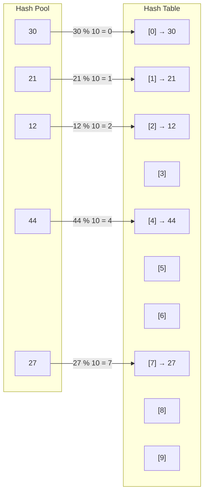

# Hashing:

- Hashing refers to the process of generating a small sized output (that can be used as index in a table) from an input of typically large and variable size. Hashing uses mathematical formulas known as hash functions to do the transformation. This technique determines an index or location for the storage of an item in a data structure called Hash Table.

- [Youtube](https://youtu.be/mFY0J5W8Udk?si=xvW3DzUxCHlsMzOk)

- Method to store or retrive data in O(1) time.

## Components of Hashing:

- There are majorly three components of hashing:

1. **Key:** A Key can be anything string or integer which is fed as input in the hash function the technique that determines an index or location for storage of an item in a data structure.
2. **Hash Function:** Receives the input key and returns the index of an element in an array called a hash table. The index is known as the hash index .
3. **Hash Table:** Hash table is typically an array of lists. It stores values corresponding to the keys. Hash stores the data in an associative manner in an array where each data value has its own unique index.

### Hash Functions:

# Hash Functions in DSA

| Hash Function             | Formula / Method                                   | Example                                                           | Result / Use                                                |
| ------------------------- | -------------------------------------------------- | ----------------------------------------------------------------- | ----------------------------------------------------------- |
| **Division Method**       | `h(k) = k % m`                                     | `k = 25, m = 10` → `25 % 10`                                      | `5` — Most common basic method                              |
| **Multiplication Method** | `h(k) = floor(m × (kA mod 1))`                     | `k=25, m=10, A≈0.618` → `25×0.618=15.45` → fractional part `0.45` | `floor(10×0.45)=4`                                          |
| **Mid-Square Method**     | Square key → extract middle digits                 | `44² = 1936` → middle `93` → `93 % 10`                            | `3`                                                         |
| **Folding Method**        | Split key into parts → add parts                   | `12345678` → `12+34+56+78=180` → `180%10`                         | `0`                                                         |
| **Digit Extraction**      | Select specific digits from key                    | `123456` → select `2nd,4th,6th` → `246` → `246%10`                | `6`                                                         |
| **Digit Analysis**        | Choose digits that provide good distribution       | Keys: `123456, 124356, 125436` → choose varying digit positions   | Reduces collisions                                          |
| **String Character Sum**  | Sum character values                               | `"CAT"` → `67+65+84=216` → `216%10`                               | `6` — Simple but collision-prone                            |
| **Polynomial Hash**       | `h(s)=Σ s[i]×pⁱ mod m`                             | `"ABC"`, values `1,2,3`, `p=31`, `m=100` → `2946%100`             | `46`                                                        |
| **Rolling Hash**          | Update previous hash instead of recalculating      | `hash("ABC")` → remove `A`, add `D` to get hash of `"BCD"`        | Fast substring matching                                     |
| **Universal Hashing**     | `h(k)=((ak+b)%p)%m`                                | `k=25,a=3,b=7,p=101,m=10` → `82%10`                               | `2` — Reduces predictable collisions                        |
| **Perfect Hashing**       | Hash function maps each known key to a unique slot | Keys `{10, 20, 30}` → `10→0, 20→1, 30→2`                          | `O(1)` lookup, no collisions                                |
| **Cryptographic Hash**    | Complex one-way transformation                     | `"Hello"` → SHA-256 → fixed-length hash                           | Security, integrity; generally not used for DSA hash tables |
| **Java `hashCode()`**     | Built-in object/string hash function               | `"Hello".hashCode()`                                              | Integer hash used by `HashMap`, `HashSet`, etc.             |

**Example:** With Division method

```text
Hash Function: h(k) = k % 10

Calculation:

12 % 10 = 2   →  HashTable[2] = 12
21 % 10 = 1   →  HashTable[1] = 21
30 % 10 = 0   →  HashTable[0] = 30
44 % 10 = 4   →  HashTable[4] = 44
27 % 10 = 7   →  HashTable[7] = 27
```

