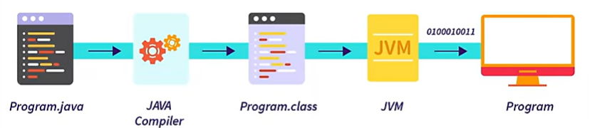
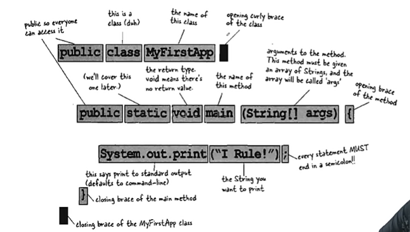
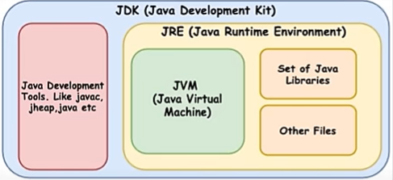
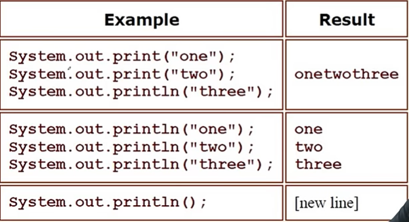

# JAVA BASICS

## Installing JDK:

- Downlod Latest DJK from oracle website.
- After Installing Verify Installation:
```bash
javac -version
```
--- 

## First Class using Text Editor:

```java
import java.lang.*;

public class FirstProgram {
  public static void main(String[] args) {
    System.out.println("Welcome to JAVA Basics");
  }
}
```
- Now Open Terminal:
```bash
javac FirstProgram.java
```
- It will convert the code in bytecode(not 0 1) by creating a file named FirstProgram.class.
- Now to Run the program:
```bash
java FirstProgram
```
- Output:
```text
Welcome to JAVA Basics
```
---

## Compiling & Running:



- After Creating Java Program, With javac (Java Compiler) make it bytecode file (.class), then with JVM run (0 1 conversion) the code.

---

## Anatomy of a Class:



---

## File Extensions:

1. .java:
    - Contain Java Source Code.
    - High Level Human Readable.
    - Used for Development.
    - File is editable.
2. .class:
    - Contains java Bytecode.
    - For consumption of JVM.
    - Used for execution.
    - Not meant to be edited.

---

## JDK vs JVM vs JRE:



1. JDK: Java Development Kit
    - It is a software Development Kit require to develop Java applications.
    - Includes the JRE, an interpreter/ loader (java), a compiler(jaavc), doc generater & other tools.
2.  JRE:  Java Runtime Environment 
    - Its a part of JDK but can be download separately.
    - Provides the librares, the JVM & other components to run application.
    - Does not have tools for developers like compiler.
3. JVM: Java Virtual Machine.
    - Part of JRE & responsible to execute the bytecode.
    - Ensure Java's write-once-run-anywhere capability.
    - Not Platform-independent: a different JVM is needed for each type of OS.

---

## Showing Output:



---

## Importance of Main Method: 

- **Entry Point:** It is the entry point of a java program, where execution starts. Without main method JVM does not know where to start running the code.
- **Public & Static:** The main method must be oublic & static, ensuring it is accessble to JVM without needing to instantiate the class.
- **Fixed Signature:** 
   ```java
   public static void main(String args[])
   ```
   - If syntex is wrong jvm will not recognize it as starting point.

---

## Installing IDE:

- Ideal IDE for java development is Intellij Idea.
- Download Community Version of it.

---

## Programming Challenge:

1. Create a code to get output Good Morning:

```java
import java.lang.*;

public class Morning {
    public static void main(String[] args){
        System.out.print("Good Morning");
    }
}
```

---

## Practice Exercise:

#### Answer in True or False:

1. Computers understand high level languages like Java, C.
   - **False**

2. An Algorithm is a set of instructions to accomplish a task.
   - **True**

3. Computer is smart enough to ignore incorrect syntax.
   - **False**

4. Java was first released in 1992.
   - **False**

5. Java was named over a person who made good coffee.
   - **False**

6. ByteCode is platform independent. JVM is Depandent.
   - **True**

7. JDK is a part of JRE.
   - **False**

8. It's optional to declare main method as public.
   - **False**

9. .class file contains machine code(0 1).
   - **False**

10. println adds a new line at the end of the line
   - **True**

---
