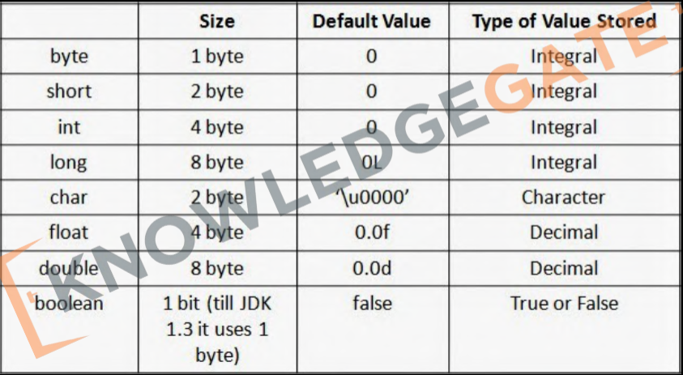
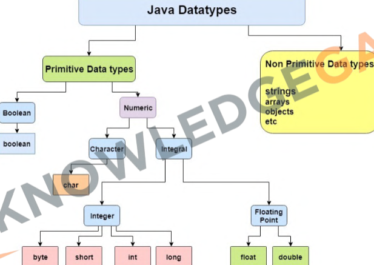
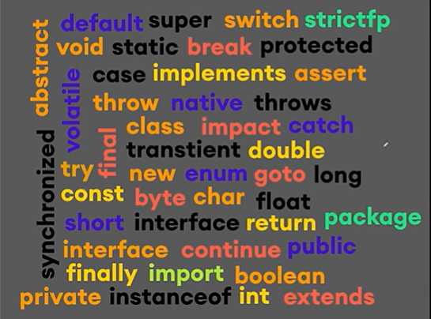
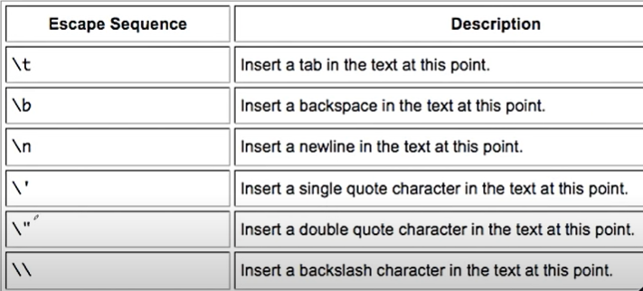
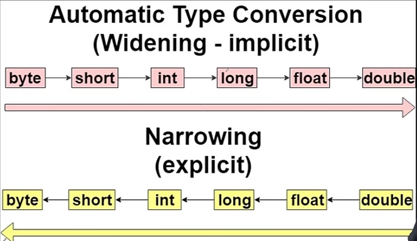

# Data Types, Variables & Input

## Variables:

- Variables are like containers used for storing data values.

```java
int age = 20;
```
---

## Data Types:






```java
public class Variables {
    public static void main(String[] args) {
        // Variable declaration
        int myNumber; // Declaring an integer variable
        myNumber = 10; // Assigning a value to the variable

        // You can also declare and assign in one line
        String myText = "Hello, World!"; // Declaring and assigning a string variable

        // Printing the variables
        System.out.println("My number is: " + myNumber);
        System.out.println("My text is: " + myText);

        // Changing the value of the variable
        myNumber = 20;
        System.out.println("My new number is: " + myNumber);
    }
}
```

```text
My number is: 10
My text is: Hello, World!
My new number is: 20
```

---

## Naming Conventions:

1. camelCase
2. snake_case
3. Kebab-case

- Choose names that are descriptve but not too long.
- It should make it easy to understand variables purpose.

**Java Identifier Rules:**

1. The only allowed characters for identifiers are all alphanumeric characters([A-Z], [a-z], [O-9]), '$' (dollar sign) and '_' (underscore).

2. Can't use keywords or reserved words

3. Identifiers should not start with digits([0-9]).

4. Java identifiers are case-sensitive.

5. There is no limit on the length of the identifier but it is advisable to use an optimum length of 4 - 15 letters only.

---

## Literals

- These are the values assign to the variables.

1. Integer Literals: 12, 9,-8
2. Boolen Literals: true, false
3. String Literals: "Hello", " " (Blank)
4. Floating Point Literals: 1.2, 6.8
5. Character Literals: 'a' , 'A'

## Keywords:

- Keywords in Java are reserved words with specific, predefined meanings for the compiler, used to define language constructs like data types, control flow, and access modifiers, and cannot be used as identifiers.
- Examples:



##  Escape Sequences:



```java
public class Escape{
    public static void main(String[] args){
        System.out.println("Hello \"Welcome\"");
    }
}
```

```text
Hello "Welcome"
```
---

## User Input:

```java
import java.util.Scanner;

public class UserInput {
    public static void main(String[] args){
        Scanner input = new Scanner(System.in);
        System.out.println("Enter Your Name: ");
        String name = input.nextLine();
        System.out.println("Good Morning " + name);
    }
}
```
```text
Enter Your Name: 
Surajit
Good Morning Surajit
```

- Similarly:

| Method          | Description                           | Example                              |
| --------------- | ------------------------------------  | ------------------------------------ |
| `nextInt()`     | Takes an integer as input             | `int age = input.nextInt();`         |
| `nextDouble()`  | Takes a decimal number as input       | `double x = input.nextDouble();`     |
| `nextLine()`    | Takes a full line of text as input    | `String name = input.nextLine();`    |
| `next()`        | Takes a single word as input          | `String word = input.next();`        |
| `nextBoolean()` | Takes a true/false value as input     | `boolean flag = input.nextBoolean();`|

---

## Type Convertion:



```java
// Autometic

float Num= 5;  // 5 is int but will converted into float.
//Only small size data will be converted to big size data like int to float.
// For big t small need of explicit convertion

int myInt = (int) 5.5; // float 5.5 will concerted into int.

```
---

