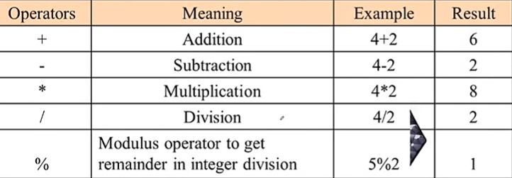
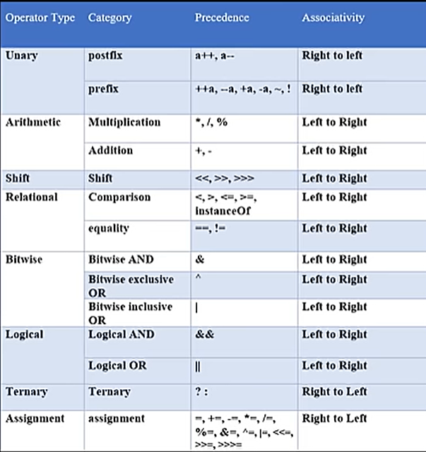

# Operators In JAVA

## Assigment Operators:
- " = " 
- Assign the values of right side into left.

```java
public class Assign {
    public static void main (String args[]){
        int myInt = 6;
        System.out.println("My integer is: " + myInt);
    }
}
```

---

## Arithmetic Operators:



```java
public class Arithmetic {
    public static void main (String args[]){
        int a =8;
        int b = 5;

        System.out.println("Addition: " + (a + b));
        System.out.println("Subtraction: " + (a - b));
        System.out.println("Multiplication: " + (a * b));
        System.out.println("Division: " + (a / b));
    }
}
```
- Output:
```text
Addition: 13
Subtraction: 3
Multiplication: 40
Division: 1
```
---

## Shorthand Operators:


---

## Unary Operators:

1. " - " : Convert a positve value to negative. (eg. x = -y)
2. "Pre Increment" : Increament the value by 1 & used in statement. ( eg. x = ++y)
3. "Pre Decrement" : Decrement the value by 1 & used in statement. ( eg. x = --y)
4. "Post Increment" : Used the currebt value in statement then increment by 1. (eg. x = y++)
5. "Post Decrement" : Used the current value in statement then decrement by 1. (eg x = y--) 

```java
public class Unary {
    public static void main(String[] args) {
        int a = 1;
        int b,c,d,e;

        b = ++a;  // a is incremented by 1 first, then assigned to b
        System.out.println("After prefix increment:");
        System.out.println("a = " + a);
        System.out.println("b = " + b);

        c = a++; // a is assigned to c first, then incremented by 1
        System.out.println("After postfix increment:"); 
        System.out.println("a = " + a);
        System.out.println("c = " + c);

        d = --a; // a is decremented by 1 first, then assigned to d
        System.out.println("After prefix decrement:");
        System.out.println("a = " + a);
        System.out.println("d = " + d); 

        e = a--; // a is assigned to e first, then decremented by 1
        System.out.println("After postfix decrement:");     
        System.out.println("a = " + a);
        System.out.println("e = " + e);
    }
}
```
- Output: 
```text
After prefix increment:
a = 2
b = 2
After postfix increment:
a = 3
c = 2
After prefix decrement:
a = 2
d = 2
After postfix decrement:
a = 1
e = 2
```

## If-Else:

```text
 if (condition) {
    ---- execute when condition is true & Skip others.
} else {
    --- execute when condition is false & Skip others.
}
```

```java
import java.util.Scanner;
public class IfElse { 
    public static void main(String[] args ){
        Scanner sc = new Scanner(System.in);
        System.out.print("Enter your age: ");

        int age = sc.nextInt();

        // If-Else Statement
        if(age >= 18){
            System.out.println("You are an adult.");
        } else {
            System.out.println("You are a minor.");
        }
    }
}
```
```java
 // short hand for one statement
 if (age>=18) System.out.println("You are an adult.");
 else System.out.println("You are a minor.");
 // Or
String result = (age >= 18) ? "You are an adult." : "You are a minor.";
```

- Output:
```text
Enter your age: 50
You are an adult.
```
---

## If-Else Ladder:

```java
public class IfElseLadder { 
    public static void main(String[] args) {
        int number = 75;

        if (number > 90) {
            System.out.println("Grade A");
        } else if (number > 80) {
            System.out.println("Grade B");
        } else if (number > 70) {
            System.out.println("Grade C");
        } else if (number > 60) {
            System.out.println("Grade D");
        } else {
            System.out.println("Grade F");
        }
    }
}
```
- Output:
```text
Grade C
```
---
## Relational Operators:

- A relational operator in Java is used to compare two values and return a boolean result (true or false).
- Order of Relational Operator is less them Arithmatic operators.

- `==` → Checks if two values are **equal**.  
- `!=` → Checks if two values are **not equal**.  
- `>` → True if left value is **greater than** right value.  
- `<` → True if left value is **less than** right value.  
- `>=` → True if left value is **greater than or equal** to right value.  
- `<=` → True if left value is **less than or equal** to right value. 

```java
public class RelationalExample {
    public static void main(String[] args) {
        int a = 10, b = 20;

        System.out.println(a == b);  // false
        System.out.println(a != b);  // true
        System.out.println(a > b);   // false
        System.out.println(a < b);   // true
        System.out.println(a >= b);  // false
        System.out.println(a <= b);  // true
    }
}
```
---
## Logical Operators: 
- Logical operators in Java are used to combine multiple boolean expressions and return a boolean result.

- **&& (Logical AND)** → Returns true only if **both** conditions are true.  
- **|| (Logical OR)** → Returns true if **any one** of the conditions is true.  
- **! (Logical NOT)** → Reverses the boolean value (true → false, false → true).  

```java
public class LogicalExample {
    public static void main(String[] args) {
        boolean x = true, y = false;

        System.out.println(x && y);  // Logical AND → false
        System.out.println(x || y);  // Logical OR  → true
        System.out.println(!x);      // Logical NOT → false
    }
}
```
---
## Java Operator Precedence:



- **Precedence** → Determines **which operator is evaluated first** in an expression.
- **Associativity** → Determines **the direction of evaluation** when operators have the same precedence (left-to-right or right-to-left).

---

## Intro to Bitwise Operators:
