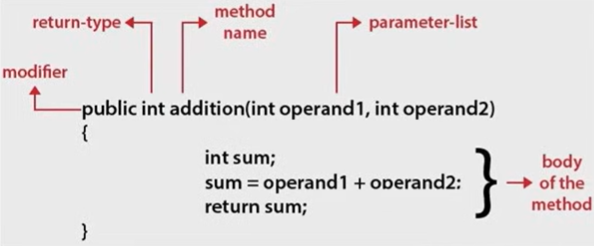
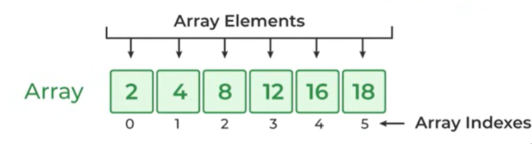
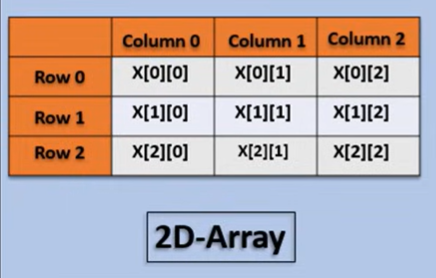

# While Loop, Methods & Arrays:

## Comments in Java:

- Used to add Notes in java code.
- Not displayed in application but usefull for code organization

- **Syntex:**
```java
//single line

/* Mulit
Line*/

// java Docs  
/**
 * This class demonstrates basic addition operations.
 * It contains methods to add two integers.
 * 
 * @author Surajit
 * @version 1.0
 */
public class Calculator {
    
}
```
---

## Loop:

- Code that runs multiple time based on condition. 
- Repetative execution of codes.
- **Types:** while, for, do-while.
- **Iteration:** No of times the loop runs. 
---

## While Loop:

- Repeating a block of code while a condition is true. 
- Syntex:
```java
while (condition){
    //Do some work.
}
```
- Example:
```java
public class WhileExample {

    public static void main(String[] args) {
        
        int i = 1; // starting value
        
        // loop runs until i becomes 5
        while (i <= 5) {
            System.out.println(i); // print number
            i++; // increase i
        }
    }
}
```
---

## Function or Methods:

- It is a block of reusable code.
- Organizes code and perform some specific tasks.
- Naming rule is same as variables.
- Follows DRY Principle: Dont Repeat Yourself.
- In Java, it’s called a **method** because every function must belong to a class (object-oriented design).

### Syntex:



- Example:

```java
import java.util.Scanner;

public class Table{ 
    //This is a method Defination  
    public static void calculate(int num){ 
         for (int i=1;  i<=10; i++){
            int value = i*num;
            System.out.println(num+"*"+i+"="+value);
         }
    }

    public static void main(String[] args){ // main method is called by JVM
         Scanner sc = new Scanner(System.in);
         System.out.print("Enter a number:");
         int num = sc.nextInt();
         calculate(num);  //This is to call the calculate method in main method
         sc.close();
    }
}
```
---

## Return Statement

- Sends a value back from a method.
- It can return value, variable, Calculation etc.
- Return ends the method immediately.

- Example: 
```java
import java.util.Scanner;

public class SumOfN {
    public static int sum( int n){   // here n is a parameter (defined)
        return (n*(n+1))/2;  // It returns this value.
    }
    public static void main(String[] args){
        Scanner sc = new Scanner(System.in);
        System.out.print("Enter a num:");
        int n = sc.nextInt();
        System.out.println(sum(n)); // here n is a argument (called the parameter)  **Both parameter and argument are same
        sc.close();
    }
}
```
---

## Array: 



- An array is a list of values.
- Index start with 0.
- Used for sorting multiple values in a single variable.

### Syntex:

```java
int[] myInts = new int[10];   // declears an empaty array "myInts" of size 10.
int[] myValues = {1,2,3,4,5}; // declears with values.

// To access:
System.out.print(myValues[0]); // gives 1

System.out.print(myValues[5]); // there are only 0-4 index so it will show "ArrayIndexOutOfBoundsException" Error.
```
- Once decleared size of array cannot be changed.

- Example: array takes input and prints it using a loop:
```java
import java.util.Scanner;

public class ArrayExample {
    public static void main(String[] args) {
        Scanner sc = new Scanner(System.in);

        System.out.print("Enter size of array: ");
        int n = sc.nextInt();

        int[] arr = new int[n];

        // Input using loop
        System.out.println("Enter elements:");
        for(int i = 0; i < n; i++) {
            arr[i] = sc.nextInt();
        }

        // Output using loop
        System.out.println("Array elements are:");
        for(int i = 0; i < n; i++) {
            System.out.print(arr[i] + " ");
        }

        sc.close();
    }
}
```
---

## 2D Array:



### Syntex:

```java
arr = new int[3][4];  // 3 rows, 4 columns

int[][] arr = {  
    {1, 2, 3},
    {4, 5, 6}
}; //initialization with values

// To access
arr[0][0];
```
- Example: 2D array takes input and prints it using a loop:

```java
import java.util.Scanner;

public class Main {
    public static void main(String[] args) {
        Scanner sc = new Scanner(System.in);

        int[][] arr = new int[2][2]; // 2x2 array

        // Input
        System.out.println("Enter 4 elements:");
        for(int i = 0; i < 2; i++) {
            for(int j = 0; j < 2; j++) {
                arr[i][j] = sc.nextInt();
            }
        }

        // Output
        System.out.println("Matrix:");
        for(int i = 0; i < 2; i++) {
            for(int j = 0; j < 2; j++) {
                System.out.print(arr[i][j] + " ");
            }
            System.out.println();
        }

        sc.close();
    }
}
```

---
