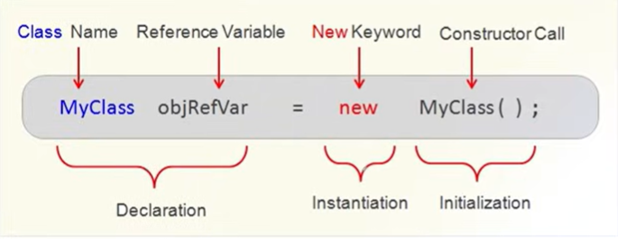

# Classes & Objects:

## Process vs Object Oriented: 

- **Process-Oriented Programming (POP)**: POP focuses on functions and procedures to perform tasks. In a bank system, separate functions like deposit(), withdraw(), and checkBalance() operate on account data. Data and functions are separate, so security is lower.

- **Object-Oriented Programming (OOP)**: OOP focuses on objects that combine both data and functions together. In a bank system, a BankAccount object contains balance data and methods like deposit() and withdraw(). This makes the system more secure and easier to manage.

---

## Instance Variable and Methods:

- Instance variables are the variables declared inside a class that store the data of an object. For example, in a bank system, accountNumber, name, and balance are instance variables of a BankAccount class.

- Instance methods are the functions defined inside a class that operate on the instance variables. In a bank system, deposit(), withdraw(), and checkBalance() are instance methods used to manage account details.

### Example Program:

```java
public class Car {
    // Instance Variables for Class Car
    int noOfWheels;
    String color;
    float maxSpeed;
    float currentFuel;
    int noOfSeats;

    // Instance Methods for Class Car

    public void drive(){
        System.out.println("Car is Running");
        currentFuel--;
    }

    public void addFuel(float fuel) {
        currentFuel+= fuel;
    }

    public static void main(String[] args){
        //main method
    }
}
```

---

## Declaring Objects:



- Object Creation: "new" instantiates a new object of a class.

```java
Car mycar = new Car();

/* This statement creates an object of the `Car` class.

Car → class name
myCar → object/reference variable
new Car() → creates a new object in memory
*/

```
- Memory allocation: Allocates memory for the object in the "heap".
- Constructor Invocation: Calls the class constractor to initilize the object.
- Return Refernce: Return a reference to the created object.
- Array Creation:    int[] arr = new int [5]. (Array is also a object.)
- Dynamic Allocation: Unlike static allocation, new allows for dynamic  allocation, memory allocation, allocating memory at runtime.

---

## Using Objects: 2.24

- By using "." operator we can access the object like "product.price".
- Example:

```java
class BankAccount {
    // Instance variables
    String name;
    double balance;

    // Method
    void showBalance() {
        System.out.println("Account Holder: " + name);
        System.out.println("Balance: " + balance);
    }
}

public class Main {
    public static void main(String[] args) {

        // Declaring and creating object
        BankAccount acc1 = new BankAccount();

        // Accessing variables using object
        acc1.name = "Rahul";
        acc1.balance = 5000;

        // Accessing method using object
        acc1.showBalance();
    }
}
```
---

## Class vs Object:

- A **class** is only a blueprint or design of an object. An **object** is the real instance created from the class that stores data and performs actions.
- Class is a logical entity that defines variables and methods.
- Object is a physical entity that uses the variables and methods of a class.
- Class does not occupy memory until an object is created, but objects occupy memory.

--- 

## This Keyword:

- It refers to the current class instance variable.
- Can be used to invoke a constructor of the same class.
- Invokes a method of the current object.
- Can be passed as an argument in the method.

- Example:
```java
class Car {
    String brand;

    // Constructor
    Car(String brand) {
        this.brand = brand; // refers to current class instance variable
    }

    // Method
    void display() {
        this.show(); // invokes current object method
    }

    void show() {
        System.out.println("Car Brand: " + brand);
    }

    // Passing current object as argument
    void details(Car c) {
        System.out.println("Passed Car: " + c.brand);
    }

    void send() {
        details(this); // passing current object
    }

    public static void main(String[] args) {
        Car c1 = new Car("Toyota");

        c1.display();
        c1.send();
    }
}
```
- It can be returned from a method to return the current object of the class.
```java
class Car {
    String brand = "Toyota";

    Car getCar() {
        return this; // returns current object
    }

    void show() {
        System.out.println(brand);
    }

    public static void main(String[] args) {
        Car c1 = new Car();
        c1.getCar().show();
    }
}
```

--- 

## Static Keyword: 2.48
