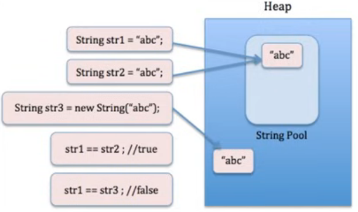

# Control Statements, Math & String:

## Ternary Operator:

- **Syntax:** variable = condition? expression1 : expression2;
- **Condition:** Boolean expreession, evaluates to true or false.
- **Expression:** Both expression must return compatible types. (ie. same type is variable).
- Used in simple expressions. But can reduce clarity of code if overused.

**Example:**
```java
import java.util.Scanner;

public class TernaryOperator{

    public static void main(String[] args){

        Scanner sc = new Scanner(System.in);
        
        System.out.print("Enter first num:");
        int num1 = sc.nextInt();
        System.out.print("Enter second num:");
        int num2 = sc.nextInt();

        //Normal Comparison to find greater number

        if (num1>num2){
            System.out.print("First num is greater.");
        } else if (num2>num1) {
            System.out.print("Second num is greater.");
        } else {
            System.out.print("Both are Equal.");   
        }

        // Using Tarnary Operator

        int greaterNum = num1>num2? num1:num2;

        // it asks if num1 is greater then num2? if true then return num1 else num2.

        System.out.println(greaterNum);
    }
}
```
---

## Switch:

- **Multiple Cases:** Handles multiple values for an expression efficiently.
- **Break Statement:** Typically used to prevent fall-through between cases.
- **Default Case:** Execute if no case matches. Optional and Does not require break.

**Example:** Day of Week Detector.
```java
public class Main {
    public static void main(String[] args) {
        int day = 3;

        switch (day) {
            case 1:
                System.out.println("Monday");
                break;

            case 2:
                System.out.println("Tuesday");
                break;

            case 3:
                System.out.println("Wednesday");
                break;

            case 4:
                System.out.println("Thursday");
                break;

            case 5:
                System.out.println("Friday");
                break;

            case 6:
                System.out.println("Saturday");
                break;

            case 7:
                System.out.println("Sunday");
                break;

            default:
                System.out.println("Invalid day");
        }
    }
}
```

**Another Expression: JAVA14+**
```java
int day = 3;

String dayName = switch (day) {
    case 1 -> "Monday";
    case 2 -> "Tuesday";
    case 3 -> "Wednesday";
    case 4 -> "Thursday";
    case 5 -> "Friday";
    case 6 -> "Saturday";
    case 7 -> "Sunday";
    default -> "Invalid day";
};

System.out.println(dayName);
```
---

## Do-While Loops:

- Syntex:

```java
do {
    //body of the loop
}
while(condition);
```
- Executes block first, then checks condition.
- Guaranteed to run at least one iteration.
- Unlike while, first iteration is unconditional.
- Need to update condition to avoid infinite loop.

**Example:** Take input of age from user & if its not between 0-100 then take input again.

```java
import java.util.Scanner;

public class Main{

    public static void main(String[] args){

        Scanner sc = new Scanner(System.in);

        //Using While Loop

        System.out.print("Enter Your Age:");
        int age = sc.nextInt();

        while (age<0 || age>100){

            System.out.print("Enter Your Age:");
            age = sc.nextInt();
        }

        System.out.print("Your age is:" + age);
    }
}
```
**Using Do-While:**
```java
int age;
do {
    System.out.print("Enter Your Age:");
    age = sc.nextInt();
} while (age<0 || age>100);
```
---

## For Loop:

- Syntex:
```java
for (initialisation; condition; update){
    //Body
}
```
- Standard loop for running code multiple times.

**Example:** Print Table of n

```java
import java.util.Scanner;

public class Main{

    public static void getTable(int n){

        for (int i=1;i<=10;i++){
            System.out.println(n + "*" + i +"="+ n*i);
        }
    }

    public static void main(String[] args){

        Scanner sc = new Scanner(System.in);

        System.out.println("Enter a num:");
        int n = sc.nextInt();

        getTable(n);
    }
}
```
---

## For Each loop:

- Syntax:
```java
for (dataType variable : array/collection){
    // Body
}
```
- Used to traverse each element of an array or collection.
- It is simpler than a traditional for loop when you don't need the index.

**Example:** Print all elements of an array.

```java
public class Main{

    public static void main(String[] args){

        int[] arr = {10, 20, 30, 40, 50};

        for (int num : arr){
            System.out.println(num);
        }
    }
}
```
---

## Using break & continue: 

- **Break** lets you stop a loop early.
- **Continue** used to skip one iteration or the current.

**Example:** Break
```java
// Traversal with break

public class Main{

    public static void main(String[] args){

        int[] arr = {10, 20, 30, 40, 50};

        for (int num : arr){
            if (num == 30){
                break;
            }
            System.out.println(num);
        }
    }
}

```
**Output:**
```text
10
20
```
**Example:** Continue
```java
// Traversal with continue

public class Main{
    public static void main(String[] args){

        int[] arr = {10, 20, 30, 40, 50};

        for (int num : arr){
            if (num == 30){
                continue;
            }
            System.out.println(num);
        }
    }
}
```
**Output:**
```text
10
20
40
50
```
---

## Recursion:

- Recursion is a function when it calls itself.

**Example:** Factorial of n.
```java
public class Main{

    public static int calFact(int n){
        if(n == 0 || n == 1){
            return 1;
        }

        return n*calFact(n-1);
    }

    public static void main(String[] args){

        System.out.println(calFact(5));
    }
}
```
---

## Random Numbers & Math class:

- `Math` is a built-in Java class (`java.lang.Math`) that provides methods for performing mathematical operations.

### Mostly used methods of math class:

| Sl. No. | Method            | Description                                    | Example                       |
| ------: | ----------------- | ---------------------------------------------- | ----------------------------- |
|       1 | `Math.abs()`      | Returns absolute value                         | `Math.abs(-10)` → `10`        |
|       2 | `Math.ceil()`     | Rounds a number up                             | `Math.ceil(4.2)` → `5.0`      |
|       3 | `Math.floor()`    | Rounds a number down                           | `Math.floor(4.8)` → `4.0`     |
|       4 | `Math.max()`      | Returns the larger value                       | `Math.max(10, 20)` → `20`     |
|       5 | `Math.min()`      | Returns the smaller value                      | `Math.min(10, 20)` → `10`     |
|       6 | `Math.pow()`      | Returns a number raised to a power             | `Math.pow(2, 3)` → `8.0`      |
|       7 | `Math.random()`   | Generates a random number from `0.0` to `<1.0` | `Math.random()` → `0.73`      |
|       8 | `Math.round()`    | Rounds to the nearest integer                  | `Math.round(4.6)` → `5`       |
|       9 | `Math.sqrt()`     | Returns square root                            | `Math.sqrt(25)` → `5.0`       |
|      10 | `Math.cbrt()`     | Returns cube root                              | `Math.cbrt(27)` → `3.0`       |
|      11 | `Math.floorDiv()` | Performs floor division                        | `Math.floorDiv(-7, 2)` → `-4` |
|      12 | `Math.floorMod()` | Returns floor modulus                          | `Math.floorMod(-7, 2)` → `1`  |

### Other Methods:

| Sl. No. | Method                  | Description                                 | Example                             |
| ------: | ----------------------- | ------------------------------------------- | ----------------------------------- |
|       1 | `Math.absExact()`       | Absolute value with overflow checking       | `Math.absExact(-10)` → `10`         |
|       2 | `Math.acos()`           | Returns inverse cosine                      | `Math.acos(1)` → `0.0`              |
|       3 | `Math.addExact()`       | Adds values with overflow checking          | `Math.addExact(10, 20)` → `30`      |
|       4 | `Math.asin()`           | Returns inverse sine                        | `Math.asin(0)` → `0.0`              |
|       5 | `Math.atan()`           | Returns inverse tangent                     | `Math.atan(0)` → `0.0`              |
|       6 | `Math.atan2()`          | Returns angle from coordinates              | `Math.atan2(1, 1)`                  |
|       7 | `Math.copySign()`       | Copies sign of one number                   | `Math.copySign(5, -1)` → `-5.0`     |
|       8 | `Math.cos()`            | Returns cosine                              | `Math.cos(0)` → `1.0`               |
|       9 | `Math.decrementExact()` | Decreases value by 1 with overflow checking | `Math.decrementExact(5)` → `4`      |
|      10 | `Math.exp()`            | Returns `e` raised to a power               | `Math.exp(1)`                       |
|      11 | `Math.expm1()`          | Returns `e^x - 1`                           | `Math.expm1(1)`                     |
|      12 | `Math.getExponent()`    | Returns exponent of floating-point value    | `Math.getExponent(8.0)`             |
|      13 | `Math.hypot()`          | Calculates `√(x² + y²)`                     | `Math.hypot(3, 4)` → `5.0`          |
|      14 | `Math.incrementExact()` | Increases value by 1 with overflow checking | `Math.incrementExact(5)` → `6`      |
|      15 | `Math.log()`            | Returns natural logarithm                   | `Math.log(10)`                      |
|      16 | `Math.log10()`          | Returns base-10 logarithm                   | `Math.log10(100)` → `2.0`           |
|      17 | `Math.log1p()`          | Calculates `log(1 + x)`                     | `Math.log1p(10)`                    |
|      18 | `Math.multiplyExact()`  | Multiplies with overflow checking           | `Math.multiplyExact(5, 4)` → `20`   |
|      19 | `Math.multiplyHigh()`   | Returns high bits of multiplication         | `Math.multiplyHigh(a, b)`           |
|      20 | `Math.negateExact()`    | Negates a value with overflow checking      | `Math.negateExact(5)` → `-5`        |
|      21 | `Math.rint()`           | Rounds to nearest integer as `double`       | `Math.rint(4.6)` → `5.0`            |
|      22 | `Math.scalb()`          | Multiplies by `2^n`                         | `Math.scalb(2, 3)` → `16.0`         |
|      23 | `Math.signum()`         | Returns the sign of a number                | `Math.signum(-10)` → `-1.0`         |
|      24 | `Math.sin()`            | Returns sine                                | `Math.sin(0)` → `0.0`               |
|      25 | `Math.subtractExact()`  | Subtracts with overflow checking            | `Math.subtractExact(20, 5)` → `15`  |
|      26 | `Math.tan()`            | Returns tangent                             | `Math.tan(0)` → `0.0`               |
|      27 | `Math.toDegrees()`      | Converts radians to degrees                 | `Math.toDegrees(Math.PI)` → `180.0` |
|      28 | `Math.toIntExact()`     | Converts `long` to `int` safely             | `Math.toIntExact(100L)` → `100`     |
|      29 | `Math.toRadians()`      | Converts degrees to radians                 | `Math.toRadians(180)` → `π`         |
|      30 | `Math.ulp()`            | Returns floating-point precision value      | `Math.ulp(1.0)`                     |

### Constants:

| Constant  | Description    | Example                  |
| --------- | -------------- | ------------------------ |
| `Math.PI` | Value of π     | `Math.PI` → `3.14159...` |
| `Math.E`  | Euler's number | `Math.E` → `2.71828...`  |

**Example:**  Find Max of two num.

```java
public class Main {
    public static void main(String[] args) {

        int a = 10;
        int b = 20;

        System.out.println(Math.max(a, b));
    }
}
```
> `Math` belongs to the `java.lang` package, which Java automatically imports.

--- 

##  toString Method:

- Syntex:

```java
    @Override
    public String toString() {
        return "Name: " + name + ", Age: " + age;
    }
```

- `toString` provides a String representation of an object.
- It inherited from the Object class.
- By default, it returns a string containing the class name and hash code.
- We can override toString() to return meaningful information about an object.
- It is automatically called when an object is printed using System.out.println().

**Example:**

```java
class Student {
}

public class Main {

    public static void main(String[] args) {

        Student s = new Student();

        // Explicitly calling toString()
        System.out.println(s.toString());  // Output: Student@2a139a55
    }
}
```

> When `toString()` is **not overridden**, it returns **the class name + `@` + the object's hash code in hexadecimal**.


**Example with with toString() overridden**
```java
class Student {

    String name;
    int age;

    Student(String name, int age) {
        this.name = name;
        this.age = age;
    }

    // Override toString() to provide a meaningful String representation
    @Override
    public String toString() {
        return "Name: " + name + ", Age: " + age;
    }
}

public class Main {

    public static void main(String[] args) {

        Student s = new Student("Surajit", 22);

        // println() automatically calls the object's toString() method
        System.out.println(s);  //Output: Name: Surajit, Age: 22
    }
}
```
---

## String Class:



- **Immutability:** Once created, a String Objects value cannot be changed.
- **String Pool:** Java maintains a pool of strings for efficiency. When a new string is created, it checked against the pool for a match to reuse.
- **Comparing:** `equals()` method for value comparison, `==` operator checks reference/object equality.
```java
String s1 = new String("Hello");
String s2 = new String("Hello");

// equals() compares the content
System.out.println(s1.equals(s2));  // true

// == compares the references
System.out.println(s1 == s2);        // false
```
- **Concatination:** Strings can be conxatenated using the `+` operator, but each concatination creates a new string.
- Being immutable, strings can use more memory when frequently modified.

**Methods:** 

| S.No. | Method                            | Description                                 | Example                                           |
| ----: | --------------------------------- | ------------------------------------------- | ------------------------------------------------- |
|     1 | `length()`                        | Returns the length of the string            | `"Hello".length()` → `5`                          |
|     2 | `charAt(i)`                       | Returns character at index `i`              | `"Hello".charAt(1)` → `'e'`                       |
|     3 | `substring(begin)`                | Returns substring from `begin` to end       | `"Hello".substring(2)` → `"llo"`                  |
|     4 | `substring(begin, end)`           | Returns substring from `begin` to `end-1`   | `"Hello".substring(1,4)` → `"ell"`                |
|     5 | `equals(str)`                     | Compares string contents                    | `"Hi".equals("Hi")` → `true`                      |
|     6 | `equalsIgnoreCase(str)`           | Compares contents ignoring case             | `"Hello".equalsIgnoreCase("hello")` → `true`      |
|     7 | `compareTo(str)`                  | Compares two strings lexicographically      | `"abc".compareTo("abd")` → `-1`                   |
|     8 | `compareToIgnoreCase(str)`        | Lexicographical comparison ignoring case    | `"ABC".compareToIgnoreCase("abc")` → `0`          |
|     9 | `toUpperCase()`                   | Converts string to uppercase                | `"hello".toUpperCase()` → `"HELLO"`               |
|    10 | `toLowerCase()`                   | Converts string to lowercase                | `"HELLO".toLowerCase()` → `"hello"`               |
|    11 | `trim()`                          | Removes leading and trailing spaces         | `" Hi ".trim()` → `"Hi"`                          |
|    12 | `strip()`                         | Removes leading and trailing whitespace     | `" Hi ".strip()` → `"Hi"`                         |
|    13 | `contains(str)`                   | Checks if string contains a sequence        | `"Hello".contains("ell")` → `true`                |
|    14 | `startsWith(str)`                 | Checks starting sequence                    | `"Hello".startsWith("He")` → `true`               |
|    15 | `endsWith(str)`                   | Checks ending sequence                      | `"Hello".endsWith("lo")` → `true`                 |
|    16 | `indexOf(str)`                    | Returns first index of occurrence           | `"Hello".indexOf("l")` → `2`                      |
|    17 | `lastIndexOf(str)`                | Returns last index of occurrence            | `"Hello".lastIndexOf("l")` → `3`                  |
|    18 | `replace(old,new)`                | Replaces characters/sequences               | `"Hello".replace('l','x')` → `"Hexxo"`            |
|    19 | `replaceAll(regex,replacement)`   | Replaces all matching patterns              | `"a1b2".replaceAll("\\d","")` → `"ab"`            |
|    20 | `replaceFirst(regex,replacement)` | Replaces first matching pattern             | `"a1b2".replaceFirst("\\d","")` → `"ab2"`         |
|    21 | `concat(str)`                     | Joins another string                        | `"Hello".concat(" World")` → `"Hello World"`      |
|    22 | `isEmpty()`                       | Checks if length is `0`                     | `"".isEmpty()` → `true`                           |
|    23 | `isBlank()`                       | Checks if empty or contains only whitespace | `"   ".isBlank()` → `true`                        |
|    24 | `split(regex)`                    | Splits string into an array                 | `"A,B,C".split(",")` → `["A","B","C"]`            |
|    25 | `toCharArray()`                   | Converts string to character array          | `"Hello".toCharArray()` → `['H','e','l','l','o']` |
|    26 | `getBytes()`                      | Converts string to byte array               | `"ABC".getBytes()`                                |
|    27 | `valueOf(x)`                      | Converts a value to a String                | `String.valueOf(123)` → `"123"`                   |
|    28 | `join(delimiter, strings)`        | Joins strings with delimiter                | `String.join("-", "A","B","C")` → `"A-B-C"`       |
|    29 | `repeat(n)`                       | Repeats the string `n` times                | `"Hi".repeat(3)` → `"HiHiHi"`                     |
|    30 | `matches(regex)`                  | Checks whether string matches a regex       | `"123".matches("\\d+")` → `true`                  |

> Array uses `length` as a field or property, while String uses `length()` as a method.

---

## printf Format Specifiers in Java:

| Specifier | Used for                    | Example                            |
| --------- | --------------------------- | ---------------------------------- |
| `%d`      | Integer                     | `printf("%d", 10)`                 |
| `%f`      | Floating-point              | `printf("%f", 10.5)`               |
| `%.2f`    | Float with 2 decimal places | `printf("%.2f", 10.567)` → `10.57` |
| `%c`      | Character                   | `printf("%c", 'A')`                |
| `%s`      | String                      | `printf("%s", "Hello")`            |
| `%b`      | Boolean                     | `printf("%b", true)`               |
| `%x`      | Hexadecimal                 | `printf("%x", 255)` → `ff`         |
| `%o`      | Octal                       | `printf("%o", 8)` → `10`           |
| `%e`      | Scientific notation         | `printf("%e", 1000.0)`             |
| `%n`      | New line                    | `printf("Hello%nWorld")`           |

**printf() Flags in Java:**

| Flag | Meaning                                 | Example                  | Output       |
| ---- | --------------------------------------- | ------------------------ | ------------ |
| `-`  | Left-align                              | `printf("%-10s", "Hi")`  | `Hi        ` |
| `+`  | Show `+` for positive numbers           | `printf("%+d", 10)`      | `+10`        |
| `0`  | Pad with zeros                          | `printf("%05d", 42)`     | `00042`      |
| ` `  | Space before positive number            | `printf("% d", 42)`      | ` 42`        |
| `,`  | Add grouping separator                  | `printf("%,d", 1000000)` | `1,000,000`  |
| `(`  | Enclose negative numbers in parentheses | `printf("%(d", -100)`    | `(100)`      |

**Example:**
```java
String name = "Surajit";
int marks = 99;

System.out.println("Hello," + name + "Your marks are:" + marks);

System.out.printf("Hello %s, your marks are: %d", name, marks);

System.out.printf("Hello %20s", name);  // Output: "Hello              Surajit"    //Space of 20
System.out.printf("Hello %-20s 0", name);  // Output: "Hello Surajit              0"      //Space of 20

```
---

## StringBuffer & StringBuilder:

| Feature          | String                          | StringBuffer                | StringBuilder                |
| ---------------- | ------------------------------- | --------------------------- | ---------------------------- |
| **Mutable**      | ❌ No                            | ✅ Yes                       | ✅ Yes                        |
| **Storage**      | String Pool / Heap              | Heap                        | Heap                         |
| **Thread-safe**  | ❌ No                            | ✅ Yes                       | ❌ No                         |
| **Synchronized** | ❌ No                            | ✅ Yes                       | ❌ No                         |
| **Speed**        | Slow for frequent modifications | Slower                      | **Fastest**                  |
| **Best Use**     | Fixed text                      | Multi-threaded applications | Single-threaded applications |


- **String** → when the text doesn't need modification; **StringBuffer** → when modifying strings in a multi-threaded environment; **StringBuilder** → when frequently modifying strings in a single-threaded environment.

**Common Methods:** 
- Both StringBuffer and StringBuilder provide methods such as:

| Method           | Description                | Example                  |
| ---------------- | -------------------------- | ------------------------ |
| `append()`       | Adds text at the end       | `sb.append("Hi")`        |
| `insert()`       | Inserts text at an index   | `sb.insert(2, "Hi")`     |
| `delete()`       | Removes characters         | `sb.delete(1, 3)`        |
| `deleteCharAt()` | Removes one character      | `sb.deleteCharAt(2)`     |
| `replace()`      | Replaces characters        | `sb.replace(0, 2, "Hi")` |
| `reverse()`      | Reverses the string        | `sb.reverse()`           |
| `length()`       | Returns length             | `sb.length()`            |
| `charAt()`       | Returns character at index | `sb.charAt(0)`           |
| `setCharAt()`    | Changes a character        | `sb.setCharAt(0, 'A')`   |
| `toString()`     | Converts to String         | `sb.toString()`          |

**Example:**

```java
public class Main {

    public static void main(String[] args) {

        // StringBuffer
        StringBuffer sb = new StringBuffer("Hello");

        // Modifies the existing object
        sb.append(" World");

        System.out.println(sb);  // Hello World


        // StringBuilder
        StringBuilder sbd = new StringBuilder("Hello");

        // Modifies the existing object
        sbd.append(" Java");

        System.out.println(sbd); // Hello Java
    }
}
```
---

## Final Keyword: 

```java
public class Main{
    public final String name = "Surajit";

    public void setName(String name){
        this.name = Jit;  //Cannont reassign in final variables.
    }
}
```

- When applied to a variable, the variable become constent, ie. it cannot be chananged once initiated.
- Used for performance optimization.
- final variable must be initialized before theconstractor completes, reducing null pointers error. 

---