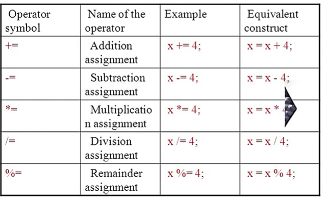

# Operators In JAVA

## Assigment Operators:
- " = " 
- Assign the values of right side into left.

```java
public class Assign {
    public static void main (String args[]){
        int myInt = 6;
        System.out.println("My integer is: " + myInt);
    }
}
```

---

## Arithmetic Operators:


```java
public class Arithmetic {
    public static void main (String args[]){
        int a =8;
        int b = 5;

        System.out.println("Addition: " + (a + b));
        System.out.println("Subtraction: " + (a - b));
        System.out.println("Multiplication: " + (a * b));
        System.out.println("Division: " + (a / b));
    }
}
```
- Output:
```text
Addition: 13
Subtraction: 3
Multiplication: 40
Division: 1
```
---

## Shorthand Operators:



---

## Unary Operators:

1. " - " : Convert a positve value to negative. (eg. x = -y)
2. "Pre Increment" : Increament the value by 1 & used in statement. ( eg. x = ++y)
3. "Pre Decrement" : Decrement the value by 1 & used in statement. ( eg. x = --y)
4. "Post Increment" : Used the currebt value in statement then increment by 1. (eg. x = y++)
5. "Post Decrement" : Used the current value in statement then decrement by 1. (eg x = y--) 

```java
public class Unary {
    public static void main(String[] args) {
        int a = 1;
        int b,c,d,e;

        b = ++a;  // a is incremented by 1 first, then assigned to b
        System.out.println("After prefix increment:");
        System.out.println("a = " + a);
        System.out.println("b = " + b);

        c = a++; // a is assigned to c first, then incremented by 1
        System.out.println("After postfix increment:"); 
        System.out.println("a = " + a);
        System.out.println("c = " + c);

        d = --a; // a is decremented by 1 first, then assigned to d
        System.out.println("After prefix decrement:");
        System.out.println("a = " + a);
        System.out.println("d = " + d); 

        e = a--; // a is assigned to e first, then decremented by 1
        System.out.println("After postfix decrement:");     
        System.out.println("a = " + a);
        System.out.println("e = " + e);
    }
}
```
- Output: 
```text
After prefix increment:
a = 2
b = 2
After postfix increment:
a = 3
c = 2
After prefix decrement:
a = 2
d = 2
After postfix decrement:
a = 1
e = 2
```